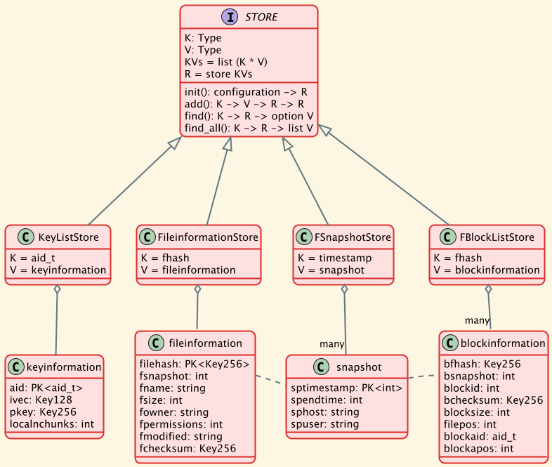

# Data Store

The eLyKseeR system stores meta information about the files and their information when running backups. The assemblies are encrypted and their encryption keys are stored as well. On a restore, these data are available again.



## Database tables

### KeyListStore

Stores the encryption keys per assembly.

K = aid_t (which is a Key256; 64 chars hex representation)

```sql
CREATE TABLE keyinformation {
    aid CHAR(64) PRIMARY KEY NOT NULL,
    ivec CHAR(32) NOT NULL,
    pkey CHAR(64) NOT NULL,
    localnchunks USMALLINT NOT NULL
};
```

### FileInformationStore

Stores meta data about the file.

K = fhash (which is a Key256; 64 chars hex representation)


```sql
CREATE TABLE fileinformation {
    filehash CHAR(64) PRIMARY KEY NOT NULL,
    fsnapshot TIMESTAMP NOT NULL,
    fname VARCHAR NOT NULL,
    fsize UBIGINT NOT NULL,
    fowner VARCHAR NOT NULL,
    fpermissions USMALLINT NOT NULL,
    fmodified TIMESTAMP NOT NULL,
    fchecksum CHAR(64) NOT NULL
};
```

### SnapshotStore

Stores additional information about a backup run (snapshot).

K = timestamp (requires good resolution, below 1 s)

```sql
CREATE TABLE snapshot {
    sptimestamp TIMESTAMP PRIMARY KEY NOT NULL,
    sphost VARCHAR NOT NULL,
    spuser VARCHAR NOT NULL,
};
```

### FBlockListStore

Stores the blocks of a file.

K = fhash (which is a Key256; 64 chars hex representation)

```sql
CREATE TABLE blockinformation {
    bfhash CHAR(64) NOT NULL,
    bsnapshot TIMESTAMP NOT NULL,
    blockid INTEGER NOT NULL,
    bchecksum CHAR(64) NOT NULL
    blocksize UBIGINT NOT NULL,
    filepos UBIGINT NOT NULL,
    blockaid VARCHAR NOT NULL,
    blockapos UBIGINT NOT NULL,
    PRIMARY KEY (bfhash, bsnapshot, blockid)
};
```

## Dependencies among tables

We can declare foreign keys to place constraints on the actions we can do with prefilled database tables.

The tables 'blockinformation' and 'fileinformation' point to a snapshot.

```sql
CREATE TABLE blockinformation {
    bfhash CHAR(64) NOT NULL,
    bsnapshot TIMESTAMP NOT NULL REFERENCES "snapshot" ON DELETE RESTRICT,
    ..
};
```

```sql
CREATE TABLE fileinformation {
    filehash CHAR(64) PRIMARY KEY NOT NULL,
    fsnapshot TIMESTAMP NOT NULL REFERENCES "snapshot" ON DELETE RESTRICT,
    ..
};
```
