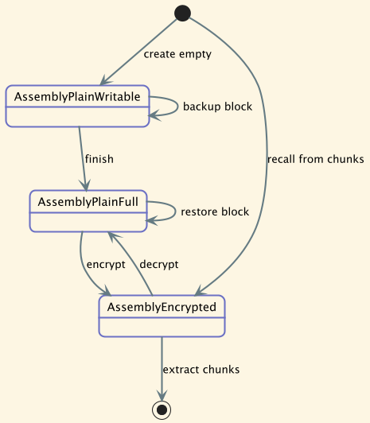
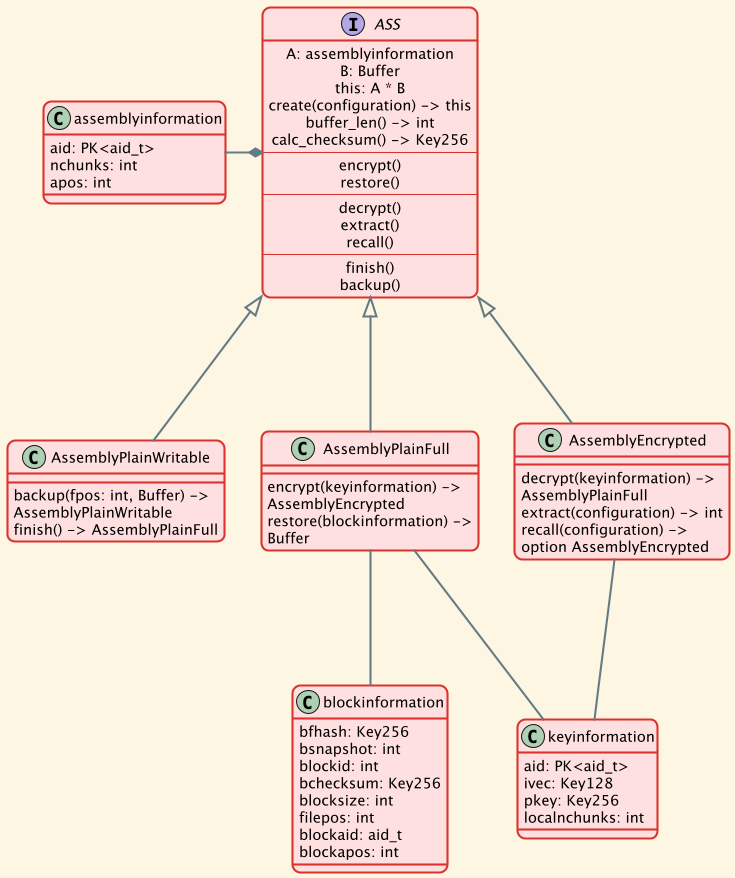
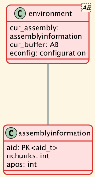

# Assemblies

File data is entered into assemblies in a non-local way and the assembly is then encrypted with strong cryptographic keys.

## Assembly states
An assembly can be in one of three states.

### AssemblyPlainWritable

In this state the assembly is writable that is data can be added: `backup()`

It can also transition to an [AssemblyPlainFull](#assemblyplainfull): `finish()`

### AssemblyPlainFull

In this state an assembly can only be read from: `restore()`

Or, it can be encrypted and thus transition to [AssemblyEncrypted](#assemblyencrypted)

### AssemblyEncrypted

An assembly that is recalled (`recall()`) from chunks is in this state.

It can be extracted into chunks: `extract()`

Or, it can be decrypted with the matching encryption keys: `decrypt()`

## Assembly methods

### creation

An assembly is created with a reference to `configuration` which defines the size of the assembly by the number of chunks it can hold. This size is between 16 and 256 chunks.

### state

At creation, a unique 256 bit `aid` is created.

The assembly remembers its size in `nchunks`.

And the field `apos` points to the next write location in the assembly's buffer.

# Environment

Related to assemblies are _environments_ that give access to assemblies and manage those.

Each environment contains the information about the assembly and the current buffer.

An environment exists in two distinct states: writable or readable.
