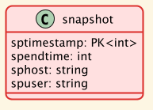

# Snapshot

Every time a backup is taken, the current time forms its snapshot identifier.

Some additional information can be stored along with it in the table [SnapshotStore](./01-DataStore.md#snapshotstore).

The meta data about files in [FileInformationStore](./01-DataStore.md#fileinformationstore) and its blocks in [FBlockListStore](./01-DataStore.md#fblockliststore) contain a reference to a snapshot.
This introduces an additional dimension of time: we can distinguish when a block has been changed, or when file meta data has changed.

## Snapshot data structure

_spTimestamp_ is the time when the backup began. It is the main reference to the snapshot.

_spEndtime_ is the time when the backup finished. No file in the backup is younger than this time.

we can also record the hostname and the user who initiated the backup for loging purpose.
