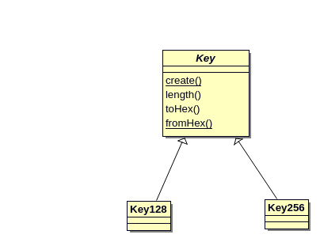
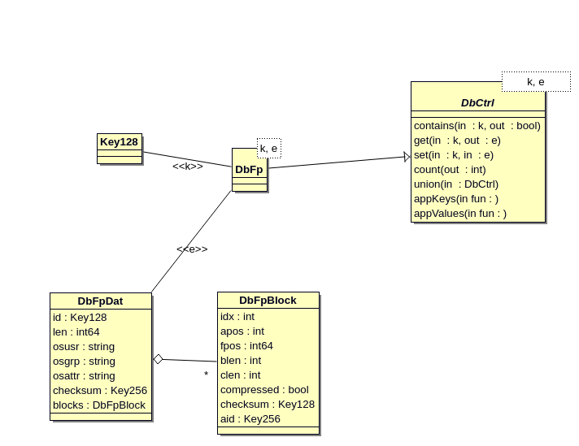
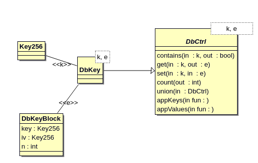

# modelling

Using [Alloy](http://alloytools.org/) for lightweight modelling.

[UML2](https://en.wikipedia.org/wiki/Unified_Modeling_Language) using [bouml](https://www.bouml.fr/)

## keys

## database of filepaths

## database of keys

